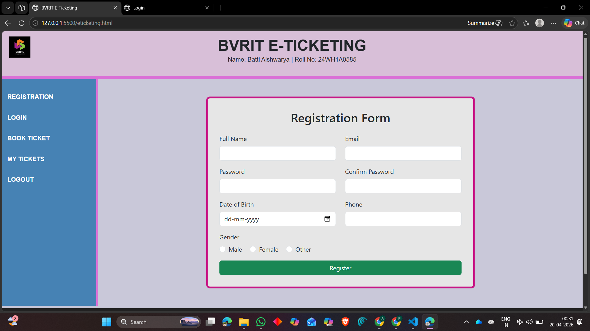
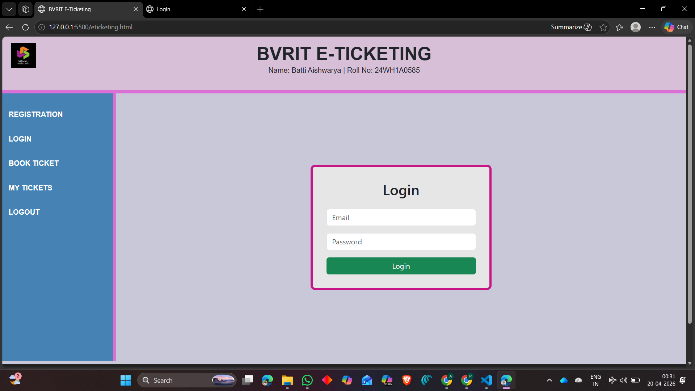
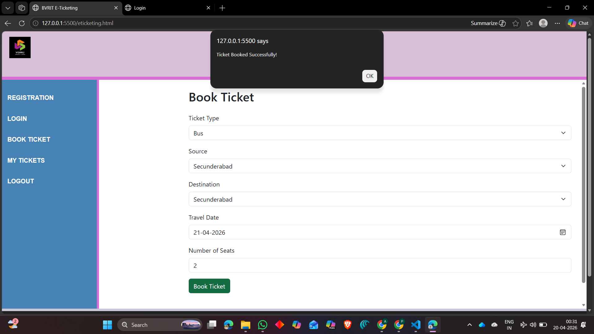
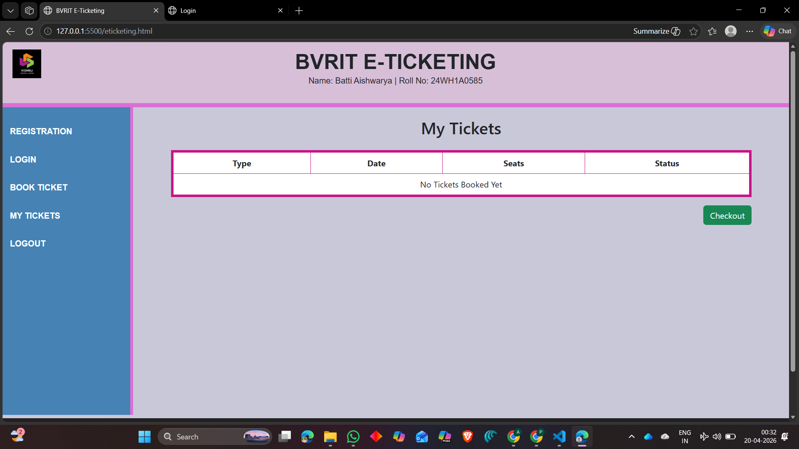
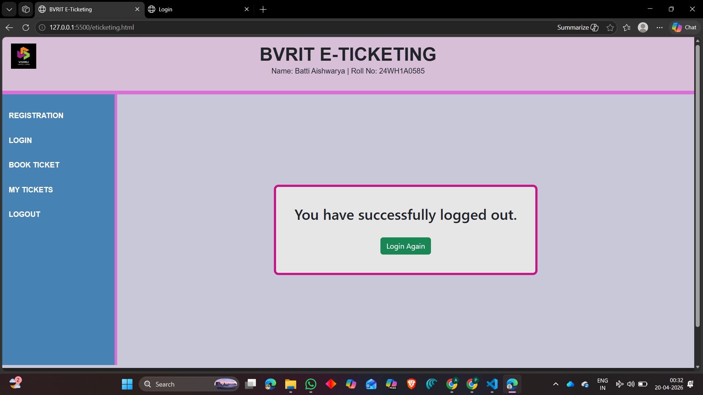

# 🎟️ BVRIT E-Ticketing Web Application

This is a responsive E-Ticketing Web Application developed using HTML5, CSS3, Bootstrap 5, and JavaScript. The application enables users to register, log in, book tickets, and manage their bookings efficiently.

---

## 📌 Features

* User Registration Page
* User Login Page
* Ticket Booking Page
* My Tickets Page (using LocalStorage)
* Logout Page
* Responsive Layout using Bootstrap Grid and Flexbox

---

## 🛠️ Technologies Used

* HTML5
* CSS3
* Bootstrap 5
* JavaScript (LocalStorage)

---

## 📷 Screenshots

### 📝 Registration Page



---

### 🔑 Login Page



---

### 🎫 Ticket Booking Page



---

### 📄 My Tickets Page



---

### 🚪 Logout Page



---

## 📂 Project Structure

E-Ticketing Application/
│── registration.html   ← Registration Page
│── login.html          ← Login Page
│── booking.html        ← Ticket Booking Page
│── mytickets.html      ← My Tickets Page
│── logout.html         ← Logout Page
│── eticketing.html     ← Main / Home Page
│── eticket.css         ← Stylesheet
│── README.md
│
│── outputs/            ← Screenshots Folder
│     └── registration.png
│     └── login.png
│     └── booking.png
│     └── mytickets.png
│     └── logout.png

---

## ⚙️ How to Run the Project

1. Download or clone the repository

   ```
   git clone https://github.com/your-username/e-ticketing-app.git
   ```

2. Open the project folder

3. Run **eticketing.html** or **registration.html** in any browser

---

## 💡 Future Enhancements

* Backend Integration (Node.js / Firebase)
* Database Storage (instead of LocalStorage)
* Payment Gateway Integration
* Admin Dashboard

---

## 👩‍💻 Developed By

**Name:** G. Pranathi
**Roll No:** 24WH1A0584

---

## ⭐ Acknowledgement

This project was developed as part of academic learning to demonstrate front-end web development skills.

---
